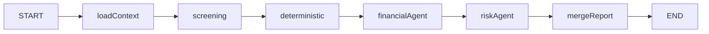

# LangGraph architecture for full diligence

_Keystone · CSB Tech Day Hackathon codebase._

Full diligence runs **inside the background worker** (`/api/cron/diligence-worker` → `processNextDiligenceJob` → `runDiligenceJob`). The HTTP layer only enqueues work; **no graph** runs in the browser or in `POST /api/diligence/start`.

## Boundary

| Layer | Responsibility |
|-------|----------------|
| `POST /api/diligence/start` | AuthZ landlord, optional consent gate, set `diligence_status = queued` |
| `process-queue` | Claim `queued` → `running`, reconcile stuck `running`, call `runDiligenceJob` |
| `runDiligenceJob` | `getCompiledDiligenceGraph().invoke({ applicationId })`, then persist `finalReport` to Postgres |
| **LangGraph** | Load context → screening vendor → deterministic math → **financial LLM** → **risk LLM** → **merge LLM** |

Partial DB updates (e.g. `diligence_external_order_id`) still occur **inside** the `screening` node.

## State shape

Defined in [`lib/diligence/graph/state.ts`](../lib/diligence/graph/state.ts) as `DiligenceStateAnnotation`:

- `applicationId` — input from worker (required).
- `appRow` — full `applications` row as a record (after `loadContext`).
- `propertyMonthlyRent`, `propertyAddress` — from joined `properties`.
- `providerId`, `externalOrderId` — screening provider metadata.
- `vendor` — `NormalizedScreeningReport` after vendor polling.
- `deterministic` — `DeterministicFit` from rent/income math.
- `financialAgentText` — output of the financial sub-agent.
- `riskAgentText` — output of the risk/stability sub-agent.
- `finalReport` — validated `DiligenceReport` including optional `agent_sections`.

Channels use a **replace** reducer so each node overwrites its slice of state.

## Nodes

| Node | Type | Role |
|------|------|------|
| `loadContext` | Code | Load application + property from Supabase. |
| `screening` | Code + IO | `ScreeningProvider.createOrder`, persist order id, `waitForReport`, parse `NormalizedScreeningReport`. |
| `deterministic` | Code | `computeDeterministicFit`. |
| `financialAgent` | LLM (Gemini) | Short financial affordability analysis → `financialAgentText`. See [`agents/financial.ts`](../lib/diligence/agents/financial.ts). |
| `riskAgent` | LLM (Gemini) | Risk / stability narrative → `riskAgentText`. See [`agents/risk.ts`](../lib/diligence/agents/risk.ts). |
| `mergeReport` | LLM (Gemini) | Merge sub-analyses + vendor + deterministic into final JSON; sets `agent_sections.financial_agent` / `risk_agent` verbatim. See [`agents/merge.ts`](../lib/diligence/agents/merge.ts). |

## Control flow

Linear edges only (no branching in v1):



Compiled in [`lib/diligence/graph/compile.ts`](../lib/diligence/graph/compile.ts).

## Invocation

```text
runDiligenceJob(applicationId)
  → graph.invoke({ applicationId })
  → update applications set diligence_report, diligence_status=complete, ...
```

## Failure model

- Any thrown error in a node aborts the graph; `process-queue` catches and calls `markDiligenceFailed`.
- **No** partial `diligence_report` is written on failure (only mid-pipeline fields like `diligence_external_order_id` may already be set from `screening`).
- Stuck `running` rows are reconciled by `reconcileStuckDiligenceJobs` in [`process-queue.ts`](../lib/diligence/process-queue.ts).

## Diagram maintenance

When you add nodes or edges, update this file and the mermaid diagram so they stay aligned with [`compile.ts`](../lib/diligence/graph/compile.ts).
